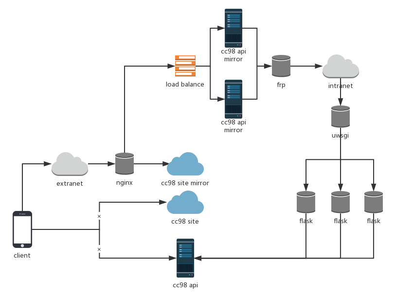

# cc98-mirror

A simple way to forward cc98 service from intranet to extranet.

## prepare

1. Extranet server like AliYun.
2. Intranet server who can connect to cc98 server.

## cc98-pwa

Refer to [cc98-pwa](https://github.com/ZJU-CC98/CC98-PWA), try to depoly this site in your extranet server as cc98 mirror site.

## forward

Use flask(requests) module to forward your request to real cc98 server. File `forward.py` provides flask api written in `Blueprint` style.

## diagram

